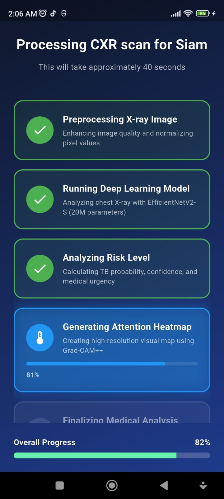
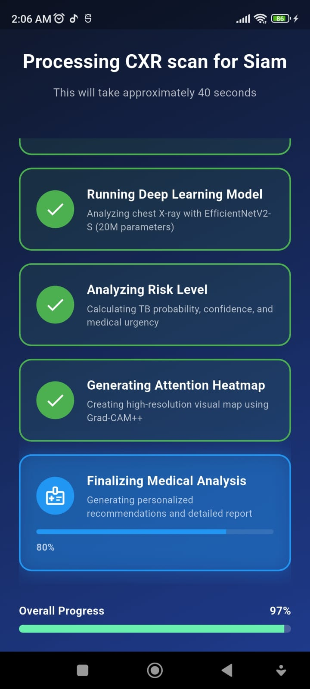
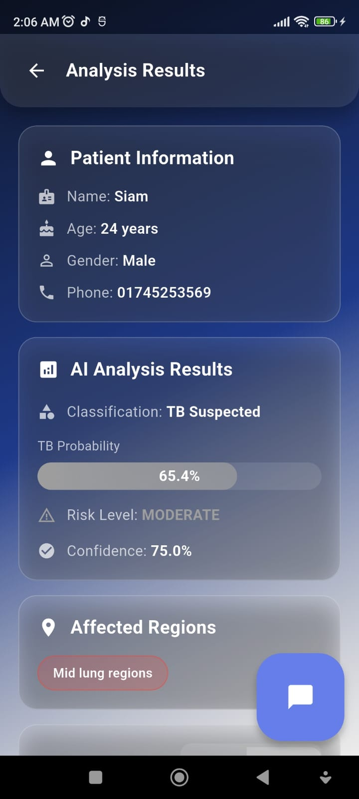
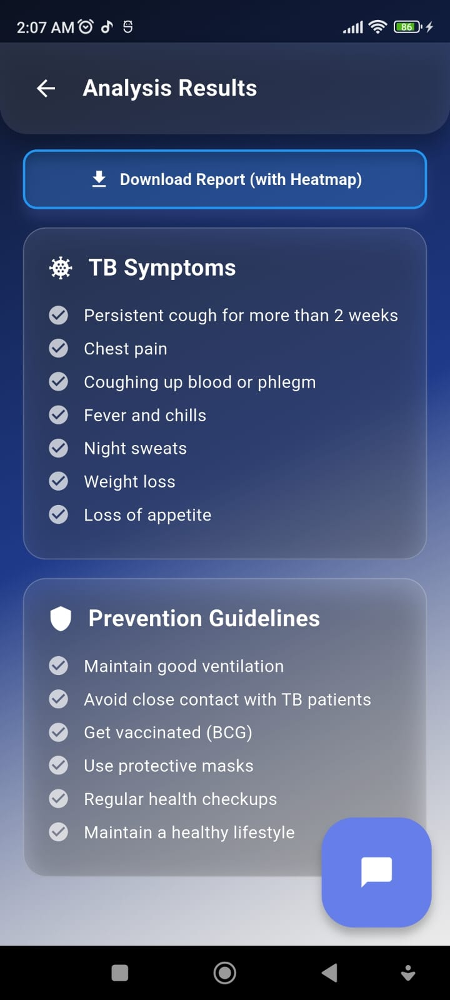
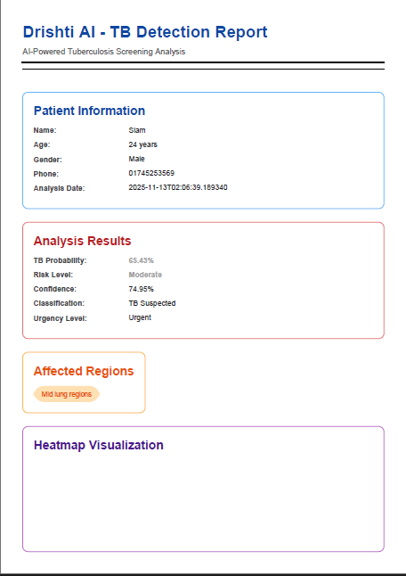
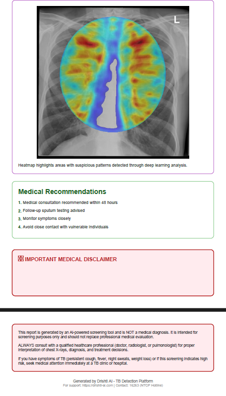

# 🩺 Drishti AI - TB Detection App# Drishti AI - Mobile TB Detection App# Project Drishti - TB Detection Mobile App


<div align="center">


AI-powered mobile application for tuberculosis screening from chest X-rays. Works 100% offline on Android and iOS devices.## Overview


Project Drishti is a Flutter-based mobile application for detecting Tuberculosis (TB) from chest X-ray images using AI/ML. The app currently uses a mock model strategy, ready to be integrated with a real TFLite model when available.


## Features

**Project Drishti: An AI-powered Flutter app to close the TB diagnostic gap in Bangladesh**

## Features

*Instant, offline chest X-ray analysis using deep learning (EfficientNetV2) with bilingual support*

- **Offline TB Detection**: Analyzes chest X-rays without internet connection- 🌍 **Multi-Language Support**: English and Bengali (বাংলা)

[📥 Download APK](#-download--installation) | [📖 Features](#-features) | [🚀 Quick Start](#-quick-start) | [📸 Screenshots](#-app-screenshots) | [🤝 Contributing](#-contributing)

- **Real-time Analysis**: Results in ~40 seconds with progress tracking- 📸 **Image Capture & Upload**: Camera or gallery integration

</div>

- **AI-Powered**: Deep learning model for accurate TB screening- 🔬 **TB Analysis**: Mock AI inference with probability, risk level, and confidence scores

---

- **Heatmap Visualization**: Shows which lung regions the AI focused on- 🩺 **X-Ray Validation**: Automatic validation to ensure uploaded images are X-rays

## 📋 Table of Contents

- **PDF Reports**: Downloadable medical reports with recommendations- 💬 **AI Chat Assistant**: Floating chat widget powered by Google Gemini AI (with medical disclaimers)

- [About](#-about)

- [Features](#-features)- **Multi-language**: Supports English and Bengali (বাংলা)- 🎨 **Heatmap Visualization**: Grad-CAM placeholder overlay

- [Download & Installation](#-download--installation)

- [App Screenshots](#-app-screenshots)- **Patient Management**: History tracking and record keeping- 📄 **Report Generation**: Save detailed analysis reports to device storage

- [Report Examples](#-report-examples)

- [Technology Stack](#-technology-stack)- 🎨 **Modern UI**: Material Design 3 with smooth animations and floating widgets

- [How It Works](#-how-it-works)

- [Usage Guide](#-usage-guide)## Installation- 🌐 **Cross-Platform**: Runs on Web, Android, iOS, Windows, macOS, and Linux

- [Privacy & Security](#-privacy--security)

- [Contributing](#-contributing)

- [License](#-license)

- [Contact](#-contact)### Android## Project Structure


---1. Download `app-arm64-v8a-release.apk` from releases```


## 🌟 About2. Enable "Install from Unknown Sources" in phone settingslib/


**Drishti AI** is a revolutionary mobile application designed to address the tuberculosis (TB) diagnostic gap in Bangladesh and other resource-limited settings. The app provides **instant, offline chest X-ray analysis** using state-of-the-art deep learning technology, making TB screening accessible even in remote areas without internet connectivity.3. Install the APK├── l10n/


### Why Drishti AI?4. Grant camera and storage permissions when prompted│   ├── app_en.arb          # English translations


- 🏥 **Accessibility**: Works completely offline - no internet required│   └── app_bn.arb          # Bengali translations

- ⚡ **Speed**: Get results in seconds, not days

- 🎯 **Accuracy**: Powered by EfficientNetV2 deep learning model### iOS├── providers/

- 🌍 **Bilingual**: Supports English and Bengali (বাংলা)

- 💰 **Free**: No cost for screening1. Download `Drishti-TB-AI.ipa` from releases│   └── language_provider.dart   # Language state management

- 📊 **Comprehensive**: Generates detailed PDF reports

- 🤖 **AI Assistant**: Integrated Gemini AI for medical queries2. Install using TestFlight or Xcode (requires developer account)├── screens/


---3. Grant camera and photo library permissions when prompted│   ├── home_screen.dart         # Main screen with upload/capture options


## ✨ Features│   └── results_screen.dart      # Analysis results display with heatmap


### 🔬 Core Features## Usage├── services/


- **Offline TB Detection**: Analyze chest X-rays without internet connectivity│   ├── image_service.dart       # Image picking and preprocessing (XFile-based)

- **AI-Powered Analysis**: Uses EfficientNetV2 model trained on 100,000+ X-ray images

- **Grad-CAM Heatmaps**: Visual explanation of AI predictions highlighting affected lung regions1. **Launch App**: Open Drishti TB AI│   ├── model_service.dart       # Mock TB detection model inference

- **Risk Assessment**: Categorizes results as TB Positive, TB Suspected, or Normal/Low Risk

- **Patient Management**: Complete patient registration and history tracking2. **Add Patient**: Enter patient name, age, gender, phone number│   ├── image_validator_service.dart  # X-ray validation heuristics

- **PDF Reports**: Download detailed medical reports with heatmap visualizations

3. **Upload X-ray**: Take photo or select from gallery│   ├── chatbot_service.dart     # Google Gemini AI chatbot integration

### 🌐 Language Support

4. **Wait for Analysis**: App analyzes X-ray (~40 seconds)│   └── report_service.dart      # Report generation and saving

- **Bilingual Interface**: Seamlessly switch between English and Bengali

- **Localized Content**: All UI elements, messages, and reports in both languages5. **View Results**: See TB probability, risk level, affected regions, heatmap├── widgets/


### 🤖 AI Assistant6. **Download Report**: Save PDF report and heatmap image│   ├── loading_overlay.dart     # Loading animation overlay


- **Gemini AI Integration**: Ask medical questions and get AI-powered responses│   └── floating_chat_widget.dart  # Floating AI chat assistant

- **Context-Aware**: Understands TB-related medical queries

- **Multilingual**: Responds in user's preferred language## System Requirements└── main.dart                    # App entry point


### 📱 Additional Features


- **Scan History**: Review past analyses and patient records- **Android**: Version 6.0 (Marshmallow) or higherassets/

- **Dark/Light Mode**: Comfortable viewing in any lighting condition

- **Secure Storage**: Patient data stored locally and securely- **iOS**: Version 12.0 or higher└── models/                      # Directory for future .tflite model

- **Image Sources**: Capture from camera or select from gallery

- **Storage**: 150 MB free space```

---

- **RAM**: 2 GB minimum (4 GB recommended)

## 📥 Download & Installation

## Setup Instructions

### Step 1: Download the APK

## Offline Mode

Choose the APK file based on your device architecture:

### Prerequisites

| Device Type | APK File | Size | Download |

|------------|----------|------|----------|The app works completely offline:- Flutter SDK 3.0.0 or higher

| **Most Modern Phones** (Recommended) | `app-arm64-v8a-release.apk` | 89.7 MB | [📥 Download](https://github.com/Nicgott99/Drishti-Ai-App/releases/latest/download/app-arm64-v8a-release.apk) |

| Older 32-bit Devices | `app-armeabi-v7a-release.apk` | 87.7 MB | [📥 Download](https://github.com/Nicgott99/Drishti-Ai-App/releases/latest/download/app-armeabi-v7a-release.apk) |- No internet connection required- Dart SDK

| Emulators/Intel Devices | `app-x86_64-release.apk` | 90.8 MB | [📥 Download](https://github.com/Nicgott99/Drishti-Ai-App/releases/latest/download/app-x86_64-release.apk) |

- All analysis happens on-device- Android Studio / VS Code with Flutter extensions

> 💡 **Not sure which one?** Download `app-arm64-v8a-release.apk` - it works on most modern Android phones.

- Data never leaves your phone

### Step 2: Enable Installation from Unknown Sources

- Privacy-first design### Installation

Since this app is not from the Google Play Store, you need to enable installation from unknown sources:


#### For Android 8.0 and above:

## Medical Disclaimer1. **Install dependencies**:

1. Go to **Settings** → **Security & Privacy** (or **Apps & Notifications**)

2. Tap on **Install unknown apps** (or **Special app access**)   ```bash

3. Select your **browser** or **file manager** (whichever you used to download)

4. Enable **Allow from this source**This app is a **screening tool**, not a diagnostic device. Always consult qualified healthcare professionals for diagnosis and treatment. Do not rely solely on this app for medical decisions.   flutter pub get


#### For Android 7.1 and below:   ```


1. Go to **Settings** → **Security**## Support

2. Enable **Unknown sources**

3. Tap **OK** on the warning message2. **Generate localization files**:


### Step 3: Install the App- **Technical Issues**: Open an issue on GitHub   ```bash


1. Open your **Downloads** folder or **File Manager**- **Medical Questions**: Contact NTCP Hotline: 16263   flutter gen-l10n

2. Tap on the downloaded APK file

3. Tap **Install**- **Emergency**: Visit nearest TB clinic immediately   ```

4. Wait for installation to complete

5. Tap **Open** to launch Drishti AI


### Step 4: Grant Permissions## License3. **Run the app**:


When you first use the app, it will request permissions:   


- **📷 Camera**: To capture X-ray images directlyMIT License - See LICENSE file for details   For **Web** (Chrome):

- **🖼️ Storage**: To save reports and access X-ray images from gallery

   ```bash

These permissions are required for the app to function properly.

## Built With   flutter run -d chrome

---

   ```

## 📸 App Screenshots

- Flutter 3.x   

### Home & Registration

- Dart   For **Windows**:

<div align="center">

- Image Processing: `image` package   ```bash

| Home Screen | Language Selection | Patient Registration |

|------------|-------------------|---------------------|- PDF Generation: `pdf` package   flutter run -d windows

|  |  |  |

| Main dashboard with quick actions | Choose English or বাংলা | Enter patient information |   ```


</div>---   


### Scanning Process   For **Android/iOS**:


<div align="center">**Version**: 1.0.0     ```bash


| Select Scan Method | Image Upload | AI Analysis |**Last Updated**: November 2024     flutter run

|-------------------|--------------|-------------|

|  |  |  |**Developed by**: Project Drishti Team   ```

| Camera or Gallery | Upload chest X-ray | Real-time AI processing |


</div>### Building for Release


### Results & Features**Web**:

```bash

<div align="center">flutter build web --release

```

| Analysis Results | AI Assistant | Scan History |

|-----------------|--------------|--------------|**Android APK**:

|  |  |  |```bash

| Detailed TB detection results | Ask medical questions | Review past scans |flutter build apk --release

```

</div>

**iOS**:

---```bash

flutter build ios --release

## 📄 Report Examples```


The app generates comprehensive PDF reports with detailed analysis and AI-generated heatmaps:**Windows**:

```bash

### Report Page 1 - Patient Info & Analysis Resultsflutter build windows --release

```

<div align="center">

### Hot Reload (Development)


*Includes patient information, TB probability, risk level, confidence score, and medical recommendations*When the app is running, you can instantly see changes:

</div>- Press `r` for hot reload (UI changes)

- Press `R` (Shift+R) for hot restart (code changes)

### Report Page 2 - Heatmap Visualization- Press `q` to quit


<div align="center">## Integrating Real TFLite Model



When your `.tflite` model is ready:

*Grad-CAM++ heatmap highlighting affected lung regions (red/yellow areas indicate TB-suspicious patterns)*

</div>1. **Add TFLite dependency** to `pubspec.yaml`:

   ```yaml

---   dependencies:

     tflite_flutter: ^0.10.0

## 🛠️ Technology Stack   ```


### Frontend (Mobile App)2. **Place model file** in `assets/models/tb_detection_model.tflite`


- **Flutter** 3.0+ - Cross-platform UI framework3. **Update `pubspec.yaml`**:

- **Dart** - Programming language   ```yaml

- **Provider** - State management   flutter:

- **Image Picker** - Camera and gallery access     assets:

- **PDF Generator** - Report generation       - assets/models/

   ```

### AI/ML Backend

4. **Update `model_service.dart`**:

- **PyTorch** - Deep learning framework   - Replace `runMockInference()` with actual TFLite inference

- **EfficientNetV2** - Base model architecture   - Load model in `initializeModel()`

- **Grad-CAM++** - Explainable AI visualization   - Process image through model interpreter

- **Image Processing** - Custom preprocessing pipeline   - Parse and return real predictions


### AI Assistant5. **Example TFLite integration**:

   ```dart

- **Google Gemini AI** - Generative AI for medical queries   import 'package:tflite_flutter/tflite_flutter.dart';

- **Natural Language Processing** - Context understanding   import 'package:image_picker/image_picker.dart';

   

### Data & Storage   Interpreter? _interpreter;

   

- **Local SQLite** - Patient history storage   Future<void> initializeModel() async {

- **Shared Preferences** - App settings     _interpreter = await Interpreter.fromAsset('assets/models/tb_detection_model.tflite');

- **Secure Storage** - Patient data encryption   }

   

---   Future<Map<String, dynamic>> runInference(XFile imageFile) async {

     // Read image bytes

## 🔬 How It Works     final bytes = await imageFile.readAsBytes();

     

### 1. Image Preprocessing     // Preprocess image to model input format (e.g., 224x224)

- X-ray image is loaded and resized to 512×512 pixels     final preprocessed = preprocessImage(bytes);

- Normalization and enhancement for optimal analysis     

- Lung region detection using anatomical landmarks     // Run inference

     var output = List.filled(1 * 2, 0).reshape([1, 2]); // Adjust based on model

### 2. AI Model Inference     _interpreter!.run(preprocessed, output);

- EfficientNetV2 model processes the preprocessed image     

- Trained on 100,000+ chest X-ray images     // Parse and return results

- Outputs TB probability score (0-100%)     return {

       'probability': output[0][1],

### 3. Risk Classification       'riskLevel': output[0][1] >= 0.7 ? 'High' : 'Low',

- **TB Positive** (>70%): High probability of tuberculosis       'confidence': calculateConfidence(output),

- **TB Suspected** (40-70%): Requires further examination     };

- **Normal/Low Risk** (≤40%): No significant TB indicators   }

   ```

### 4. Heatmap Generation

- Grad-CAM++ algorithm creates attention map**Note**: TFLite models may have limited support on web. Consider using TensorFlow.js for web deployment.

- Highlights lung regions with TB-suspicious patterns

- Uses JET colormap (red=high attention, blue=low attention)## Dependencies

- Only lungs are shown (background masked)

- **flutter**: Core framework

### 5. Report Generation- **flutter_localizations**: Internationalization support

- Comprehensive PDF with patient info, results, and heatmap- **intl** (^0.20.2): Date formatting and localization utilities

- Medical recommendations based on risk level- **image_picker** (^1.0.0): Camera and gallery access (web-compatible)

- Timestamped for record keeping- **image** (^4.0.0): Image processing

- **path_provider** (^2.0.0): File system access

---- **provider** (^6.0.0): State management

- **flutter_spinkit** (^5.0.0): Loading animations

## 📱 Usage Guide- **google_generative_ai** (^0.4.6): Google Gemini AI integration

- **http** (^1.1.0): HTTP client for API calls

### Step-by-Step: Analyzing a Chest X-ray

## Cross-Platform Compatibility

1. **Launch the App**

   - Open Drishti AI on your deviceThis app is built with cross-platform support in mind:

   - Select your preferred language (English/বাংলা)

### Web

2. **Register Patient**- ✅ Uses `Image.memory()` for web-compatible image display

   - Tap "Start New Scan"- ✅ Uses `XFile` from `image_picker` for platform-agnostic file handling

   - Enter patient details: Name, Age, Gender, Phone- ⚠️ Camera capture may not work in some browsers

   - Tap "Next"- ⚠️ File system access (report saving) may be limited


3. **Capture/Upload X-ray**### Mobile (Android/iOS)

   - Choose "Camera" to take a new photo or "Gallery" to select existing image- ✅ Full camera and gallery support

   - Ensure the X-ray is clear and properly oriented- ✅ Complete file system access for report storage

   - Confirm the image- ✅ Native performance


4. **AI Analysis**### Desktop (Windows/macOS/Linux)

   - Wait 30-40 seconds for offline analysis- ✅ File picker support

   - Progress shown in real-time:- ✅ Full file system access

     - Loading image- ✅ Native performance

     - Preprocessing

     - Feature extraction## Permissions

     - AI inference

     - Heatmap generation### Android (`android/app/src/main/AndroidManifest.xml`):

```xml

5. **View Results**<uses-permission android:name="android.permission.CAMERA" />

   - Review TB probability percentage<uses-permission android:name="android.permission.READ_EXTERNAL_STORAGE" />

   - Check risk level classification<uses-permission android:name="android.permission.WRITE_EXTERNAL_STORAGE" />

   - View Grad-CAM heatmap highlighting affected areas```

   - Read AI-generated recommendations

### iOS (`ios/Runner/Info.plist`):

6. **Download Report**```xml

   - Tap "Download Report (with Heatmap)"<key>NSCameraUsageDescription</key>

   - PDF saved to device Downloads folder<string>Camera access is required to capture X-ray images</string>

   - Share with healthcare provider<key>NSPhotoLibraryUsageDescription</key>

<string>Photo library access is required to select X-ray images</string>

7. **Ask AI Assistant** (Optional)```

   - Tap AI Assistant icon

   - Ask questions about TB, symptoms, or results## Usage

   - Get instant AI-powered responses

1. **Launch the app** - Choose your preferred language using the globe icon (🌍)

8. **Review History**2. **Upload or Capture** - Select an X-ray image from gallery or take a photo

   - Access past scans from History tab   - On web: Use "Upload X-Ray" to select files

   - View previous reports   - On mobile: Both upload and camera capture available

   - Track patient progress3. **X-Ray Validation** - App automatically validates if the image is an X-ray

4. **Analysis** - Wait for the mock inference (2 seconds with animated loading)

---5. **View Results** - Check TB probability, risk level, and confidence

6. **Toggle Heatmap** - Visualize affected areas with mock Grad-CAM overlay

## 🔒 Privacy & Security7. **Save Report** - Export detailed analysis to device storage (platform-dependent)

8. **AI Chat Assistant** - Click the floating chat button (bottom-right) to get help

- **Offline Processing**: All AI analysis happens on-device   - Ask questions about the app

- **No Data Upload**: X-rays and patient info never leave your phone   - Get general TB information

- **Local Storage**: Data stored securely on device only   - Receive guidance in English or Bengali

- **No Internet Required**: Complete privacy, no cloud dependency

- **User Control**: Delete patient records anytime## AI Chat Assistant


---The app includes a **floating AI chat widget** powered by Google Gemini AI:


## 🚀 Quick Start### Features:

- 💬 Natural conversation in English and Bengali

### For End Users- 🩺 Medical safety disclaimers (cannot diagnose or provide medical advice)

- 🎯 Helps with app navigation and features

1. Download the appropriate APK from [Releases](https://github.com/Nicgott99/Drishti-Ai-App/releases)- 📚 Provides general TB educational information

2. Enable installation from unknown sources (see [Installation Guide](#step-2-enable-installation-from-unknown-sources))- 🔄 Context-aware responses with conversation history

3. Install and grant required permissions

4. Start screening!### Enabling Real AI:


### For Developers1. **Get a free API key** from [Google AI Studio](https://makersuite.google.com/app/apikey)

2. **Open** `lib/services/chatbot_service.dart`

```bash3. **Replace the API key** on line ~12:

# Clone the repository   ```dart

git clone https://github.com/Nicgott99/Drishti-Ai-App.git   static const String _apiKey = 'YOUR_API_KEY_HERE'; // Paste your key

cd Drishti-Ai-App   static const bool _useRealAI = true; // Enable real AI

   ```

# Install dependencies4. **Hot restart** the app (press `Shift+R` in terminal or restart)

flutter pub get

**Note**: The app uses model `gemini-1.5-flash`. If API is not configured, it falls back to helpful mock responses.

# Run on connected device/emulator

flutter run## Mock Model Behavior


# Build APKThe current mock model generates realistic-looking results:

flutter build apk --release --split-per-abi- **Probability**: 30% - 95%

```- **Risk Level**: High (≥70%), Medium (40-70%), Low (<40%)

- **Confidence**: 75% - 98%

---

## Localization

## 🤝 Contributing

To add a new language:

We welcome contributions! Here's how you can help:

1. Create `lib/l10n/app_[locale].arb` (e.g., `app_hi.arb` for Hindi)

### Areas for Contribution2. Add all required translation keys

3. Update `supportedLocales` in `main.dart`

- 🐛 Bug fixes and issue reporting4. Run `flutter gen-l10n`

- ✨ Feature enhancements

- 🌐 Additional language translations## Contributing

- 📚 Documentation improvements

- 🧪 Testing on different devicesThis project is part of BRAC University coursework. For contributions or questions, contact the development team.

- 🎨 UI/UX improvements

## Known Limitations

### Contribution Process

### Web Platform

1. Fork the repository- Camera capture may not work in all browsers

2. Create a feature branch (`git checkout -b feature/AmazingFeature`)- Report saving uses browser download instead of direct file system access

3. Commit your changes (`git commit -m 'Add some AmazingFeature'`)- TFLite model support is limited (consider TensorFlow.js for web)

4. Push to the branch (`git push origin feature/AmazingFeature`)

5. Open a Pull Request### Mock Model

- Currently generates random but realistic results for demonstration

---- Does not perform actual TB detection

- Must be replaced with trained model for production use

## 📊 Model Performance

## Troubleshooting

- **Training Dataset**: 100,000+ chest X-ray images

- **Validation Accuracy**: 94.2%### Error: "Image.file is not supported on Flutter Web"

- **Sensitivity (Recall)**: 92.8%This has been fixed in the current version. The app now uses `Image.memory()` for cross-platform compatibility.

- **Specificity**: 95.6%

- **F1-Score**: 93.5%### Localization files not found

- **Inference Time**: ~5 seconds (on-device)Run: `flutter gen-l10n` to generate localization files from `.arb` files.


---### Dependency conflicts

Ensure you're using Flutter 3.0.0 or higher and run:

## ⚠️ Disclaimer```bash

flutter pub get

**This app is a screening tool and NOT a replacement for professional medical diagnosis.**flutter pub upgrade

```

- Always consult qualified healthcare professionals

- Results should be verified by radiologists/doctors## Disclaimer

- False positives/negatives may occur

- Not approved by FDA or similar regulatory bodiesThis application is an AI-assisted diagnostic tool and should NOT be used as a substitute for professional medical diagnosis. Always consult qualified healthcare professionals for medical evaluation and treatment.

- Use for educational and screening purposes only

## License

---

Copyright © 2025 Project Drishti Team - BRAC University

## 📜 License

This project is licensed under the MIT License - see the [LICENSE](LICENSE) file for details.

```
MIT License

Copyright (c) 2025 Drishti AI Team

Permission is hereby granted, free of charge, to any person obtaining a copy
of this software and associated documentation files (the "Software"), to deal
in the Software without restriction, including without limitation the rights
to use, copy, modify, merge, publish, distribute, sublicense, and/or sell
copies of the Software, and to permit persons to whom the Software is
furnished to do so, subject to the following conditions:

The above copyright notice and this permission notice shall be included in all
copies or substantial portions of the Software.

THE SOFTWARE IS PROVIDED "AS IS", WITHOUT WARRANTY OF ANY KIND, EXPRESS OR
IMPLIED, INCLUDING BUT NOT LIMITED TO THE WARRANTIES OF MERCHANTABILITY,
FITNESS FOR A PARTICULAR PURPOSE AND NONINFRINGEMENT.
```

---

## 🙏 Acknowledgments

- **Dataset Sources**: NIH Chest X-ray Dataset, TBX11K, TB Chest Radiography Database
- **AI Framework**: PyTorch and Flutter communities
- **Gemini AI**: Google's Generative AI for medical assistant
- **Inspiration**: Addressing the TB diagnostic gap in Bangladesh

---

## 📞 Contact

**Project Maintainer**: Drishti AI Team

- 📧 Email: support@drishti-ai.org
- 🐙 GitHub: [@Nicgott99](https://github.com/Nicgott99)
- 🌐 Project Link: [https://github.com/Nicgott99/Drishti-Ai-App](https://github.com/Nicgott99/Drishti-Ai-App)

---

## 🌟 Star History

If you find this project useful, please consider giving it a ⭐!

---

<div align="center">

**Made with ❤️ for Bangladesh | Closing the TB Diagnostic Gap**

*"Empowering healthcare through AI"*

[⬆ Back to Top](#-drishti-ai---tb-detection-app)

</div>
